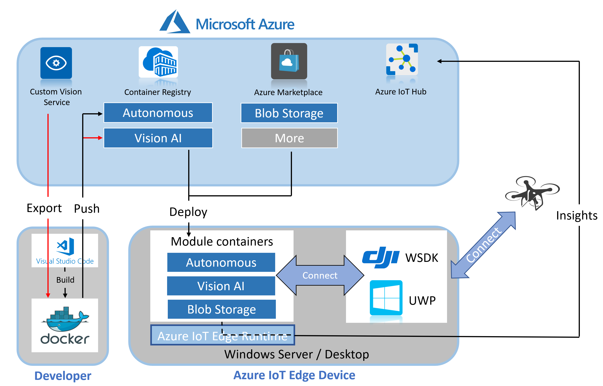

# DJI-IotEdge

## What Is This?

Azure IoT Edge is an Internet of Things (IoT) service that builds on top of IoT Hub. This service is meant for customers who want to analyze data on devices, a.k.a. "at the edge", instead of in the cloud. By moving parts of your workload to the edge, your devices can spend less time sending messages to the cloud and react more quickly to changes in status.

This project is a sample for you to learn how to combine Microsoft Azure IoT Edge and DJI Drones, so it's necessary to know about [DJI Windows SDK][1] and [IotEdge][2].

## Architecture Overview

## Prerequisites

**An Azure IoT Edge device:**

- You can use your development machine or a virtual machine as an Edge device by following the steps in the quickstart for [Windows devices][3].

**Create a container registry**

1. In the [Azure portal][8], select Create a resource > Containers > Container Registry.
2. After your container registry is created, browse to it, and then select Access keys. 
3. Copy the values for Login server, Username, and Password. You use these values later in the tutorial to provide access to the container registry. 

**Development resources:**

- [Python](https://www.python.org/downloads/)
- [Git](https://git-scm.com/downloads)
- [Visual Studio Code](https://code.visualstudio.com/)
- [Azure IoT Edge](https://marketplace.visualstudio.com/items?itemName=vsciot-vscode.azure-iot-edge) extension for Visual Studio Code
- [Python extension](https://marketplace.visualstudio.com/items?itemName=ms-python.python) for Visual Studio Code
- [Docker CE](https://docs.docker.com/install/) 
- [C# extension][4] for Visual Studio Code (powered by OmniSharp).
- [Azure IoT Tools][5] for Visual Studio Code. 

## Content

1. [How to Create an Aotunomouse Drone Module on IoT Edge](doc/HowtoCreateAnAotunomouseDroneModuleonIoTEdge.md)
2. [How to Use an Azure Blob Storage on IoT Edge](doc/HowToUseAzureBlobStorage.md)
3. [How To Use Azure Custom Visi on Service](doc/HowToUseAzureCustomVisionService.md)

[1]:https://github.com/dji-sdk/Windows-SDK
[2]:https://docs.microsoft.com/en-us/azure/iot-edge/quickstart
[3]:https://docs.microsoft.com/en-us/azure/iot-edge/quickstart
[4]:https://marketplace.visualstudio.com/items?itemName=ms-vscode.csharp
[5]:https://marketplace.visualstudio.com/items?itemName=vsciot-vscode.azure-iot-tools
[8]:https://ms.portal.azure.com/

## License

Copyright (c) Microsoft Corporation. All rights reserved.
Licensed under the [MIT](LICENSE.txt) License.
