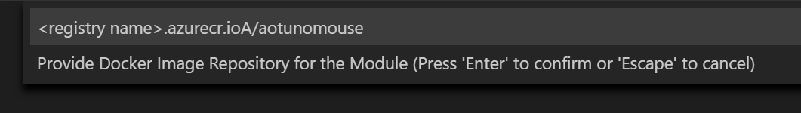
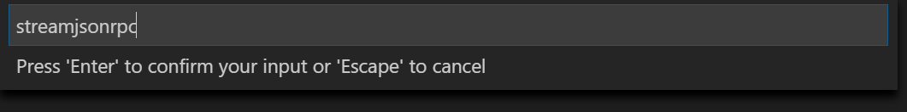
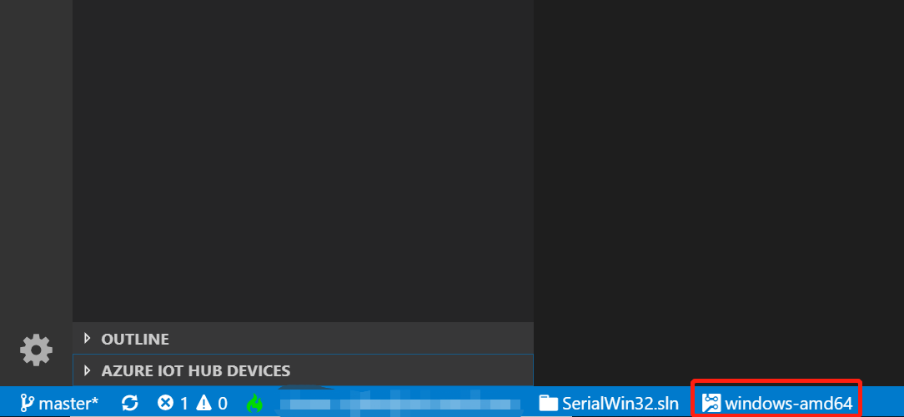
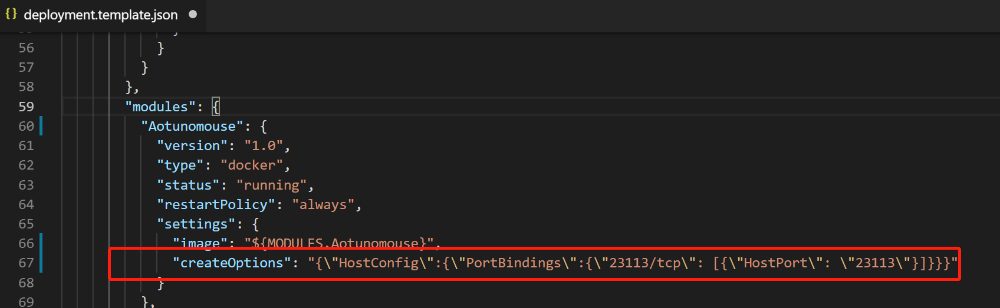
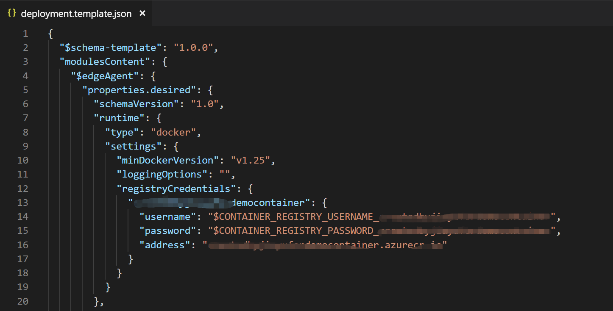
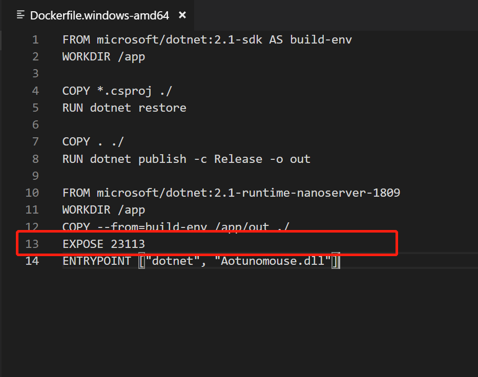
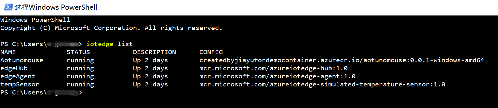
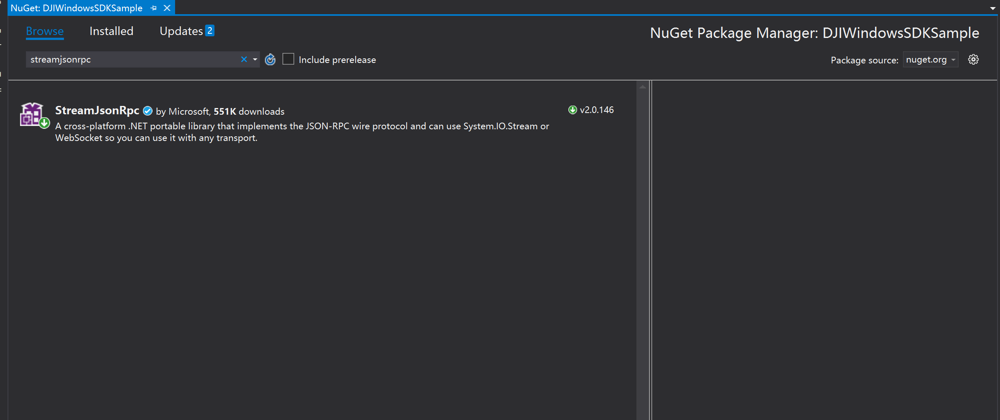

# How to Create an Aotunomouse Drone Module on IoT Edge

This session is a Simple module to control the drone ,such as taking off,landing and so on.

We build an RPC communication between IoT Edge and DJI Windows SDK Sample.Of cause , you can build them with other Communication protocol.

## How to Do

- [How to Create an Aotunomouse Drone Module on IoT Edge](#how-to-create-an-aotunomouse-drone-module-on-iot-edge)
  - [How to Do](#how-to-do)
  - [Develop a C# IoT Edge module](#develop-a-c-iot-edge-module)
      - [Create a C# solution template that you can customize with your own code.](#create-a-c-solution-template-that-you-can-customize-with-your-own-code)
      - [Add your registry credentials](#add-your-registry-credentials)
      - [Update the module with custom code](#update-the-module-with-custom-code)
  - [Build your IoT Edge solution](#build-your-iot-edge-solution)
  - [Deploy and run the solution](#deploy-and-run-the-solution)
  - [Setup your RPC Server in UWP base on DJI Sample Code](#setup-your-rpc-server-in-uwp-base-on-dji-sample-code)
      - [Add References](#add-references)
  - [Define your RPC funtions and events in a class](#define-your-rpc-funtions-and-events-in-a-class)
  - [Setup your RPC Server](#setup-your-rpc-server)
  - [Connet to Iot Edge module](#connet-to-iot-edge-module)
          - [[Learn more about customize module][8].](#learn-more-about-customize-module8)
          - [Learn more about built modules on Azure MarketPlace.](#learn-more-about-built-modules-on-azure-marketplace)
          - [Learn more about AI module on Edge](#learn-more-about-ai-module-on-edge)

<span id = "Develop">

## Develop a C# IoT Edge module 

<span id = "Create">

#### Create a C# solution template that you can customize with your own code. 

1. In Visual Studio Code, select View > Command Palette to open the VS Code command palette. 
2. In the command palette, enter and run the command Azure: Sign in and follow the instructions to sign in your Azure account. If you're already signed in, you can skip this step.
3. In the command palette, enter and run the command Azure IoT Edge: New IoT Edge solution. Follow the prompts in the command palette to create your solution


|Field|Value|  
|:---|:--|  
|Select folder|Choose the location on your development machine for VS Code to create the solution files.|   
|Provide a solution name|Enter a descriptive name for your solution or accept the default EdgeSolution.|
|Select module template|Choose C# Module.|
|Provide a module name|Name your module Aotunomouse.|
|Provide Docker image repository for the module|An image repository includes the name of your container registry and the name of your container image. Your container image is prepopulated from the name you provided in the last step. Replace localhost:5000 with the login server value from your Azure container registry. You can retrieve the login server from the Overview page of your container registry in the Azure portal. |

The final image repository looks like <registry name>.azurecr.io/aotunomouse.



<span id = "Addregistrycredentials">

#### Add your registry credentials

The environment file stores the credentials for your container registry and shares them with the IoT Edge runtime. The runtime needs these credentials to pull your private images onto the IoT Edge device. 
1. In the VS Code explorer, open the .env file. 
2. Update the fields with the username and password values that you copied from your Azure container registry. 
3. Save this file. 


<span id = "Customcode">

#### Update the module with custom code

We've got [a simple module][1] ready for you to refer to.

1. Nuget RPC references

- In the VS Code menu,View->Command Palette
- Input command  "Nuget" 
- Then input the pagckage name "streamjsonrpc" 
- Finally choose the pagckage and latest version.



- The [StreamJsonRpc][4] we used is a cross-platform, .NET portable library that implements the JSON-RPC wire protocol.

2. At the top of the Aotunomouse namespace, add three using statements for types that are used later.

- Refer in [Program.cs][3]

```CS
    using StreamJsonRpc;
    using System.Net;
    using System.Net.Sockets;
```

3. Add the definition of RPC Funtions 

- Refer in [RpcFuntions.cs][2]

4. Add funtions that Wait the message about RPC server's port from UWP

- Refer in [Program.cs][3]

```cs
   static void WaitDroneConnect()
   {
		TcpListener listener = new TcpListener(IPAddress.Any, 23113);

		listener.Start();
		
		var ClientNetworkStream = new NetworkStream(Clientsocket, true);
		byte[] recvbuffer = new byte[100];
		int recvsize = await ClientNetworkStream.ReadAsync(recvbuffer, 0, 100, new CancellationToken());
		var strrecv = Encoding.UTF8.GetString(recvbuffer);
		var targetport = strrecv.Substring(0, recvsize);
	...
   }
```
5. Initiate an RPC request

- Refer in [Program.cs][3]

```cs
	static async Task ConnectToServerAsync(string strIP, string strPort)
        {
           
            IPAddress address = IPAddress.Parse(strIP);
            TcpClient client = new TcpClient();
            await client.ConnectAsync(address, int.Parse(strPort));
            string RemoteMachineInfo = "";
            var stream = new NetworkStream(client.Client, true);

            RpcClient = JsonRpc.Attach<IRPCFuntions>(stream);

            await RpcClient.flightControllerHandler_StartTakeoffAsync();
           
            await Task.Delay(5000);
            
            await RpcClient.flightControllerHandler_StartAutoLandingAsync();
            ((IDisposable)RpcClient).Dispose();
        }
```
6.In the VS Code explorer, open the deployment.template.json file in your IoT Edge solution workspace. 
- This file tells the IoT Edge agent which modules to deploy, in this case Aotunomouse. 
The Visual Studio Code extension automatically populates most of the information that you need in the deployment template, 
but verify that everything is accurate for your solution: 



- Verify that the template has the correct module name, 
 not the default SampleModule name that you changed when you created the IoT Edge solution.

- Map the module port to local machine port.
 


- The registryCredentials section stores your Docker registry credentials, 
so that the IoT Edge agent can pull your module image. The actual username and password pairs are stored in the .env file, 
which is ignored by git. 
Add your credentials to the .env file if you haven't already.  

 

7. In the VS Code explorer, open the Dockerfile.windows-amd64 file in your IoT Edge solution workspace. 
- Define the exported port in the module



<span id = "Buildsolution">

## Build your IoT Edge solution

1. Sign in to Docker by entering the following command in the Visual Studio Code integrated terminal. Then you can push your module image to your Azure container registry.

```powershell
docker login -u <ACR username> -p <ACR password> <ACR login server>
```

- Use the username, password, and login server that you copied from your Azure container registry in the first section.
You can also retrieve these values from the Access keys section of your registry in the Azure portal.

2. In the VS Code explorer, right-click the deployment.template.json file and select Build and Push IoT Edge solution. 

- When you tell Visual Studio Code to build your solution, it first takes the information in the deployment template and generates a deployment.json file in a new folder named config. Then, it runs two commands in the integrated terminal: docker build and docker push. These two commands build your code, containerize the Aotunomouse.dll, and then push the code to the container registry that you specified when you initialized the solution. 

You can see the full container image address with tag in the VS Code integrated terminal. The image address is built from information that's in the module.json file with the format \<repository\>:\<version\>-\<platform\>. 

For this tutorial, it should look like registryname.azurecr.io/Aotunomouse:0.0.1-amd64.

<span id = "Deploysolution">

## Deploy and run the solution

1. In the VS Code command palette, run Azure IoT Hub: Select IoT Hub. 
2. Choose the subscription and IoT hub that contain the IoT Edge device that you want to configure. 
3. In the VS Code explorer, expand the Azure IoT Hub Devices section. 
4. Right-click the name of your IoT Edge device, then select Create Deployment for Single Device. 


5. Select the deployment.json file in the config folder and then click Select Edge Deployment Manifest. 
Do not use the deployment.template.json file. 
6. Click the refresh button.

Using powershell with command "iotedge list",
You can see the new Aotunomouse running along with the $edgeAgent and $edgeHub.



<span id = "SetupUWP">

## Setup your RPC Server in UWP base on DJI Sample Code

We've got [a simple UWP][5] ready for you to refer to.

<span id = "AddReferences">

### Add References

- Nuget the `StreamJsonRpc` into your solution.



- The [StreamJsonRpc][4] we used is a cross-platform, .NET portable library that implements the JSON-RPC wire protocol.

<span id = "Definefuntions">

## Define your RPC funtions and events in a class

Define a class that map the RPC Functions and events to the real DJI WSDK funtions.
Before use the DJI WSDK funtions,you should make sure that DJI WSDK is actived .

```cs
	public class DroneRpcFuntions
	{
	
	 ...
	 
        //Functions
    	public Task<ResultValue<StringMsg?>> GetDroneNameAsync() => flightControllerHandler.GetAircraftNameAsync();
        public Task UpdateJoystickValueAsync(float throttle, float roll, float pitch, float yaw) => Task.Run(() => { virtualRemoteController.UpdateJoystickValue(throttle, roll, pitch, yaw); });
        public Task<SDKError> flightControllerHandler_StartTakeoffAsync() => flightControllerHandler.StartTakeoffAsync();
        public Task<SDKError> flightControllerHandler_StartAutoLandingAsync() => flightControllerHandler.StartAutoLandingAsync();

        //Events
        public event EventHandler<BoolMsgEventArgs> flightControllerHandler_ConnectionChanged;
        public event EventHandler<BoolMsgEventArgs> flightControllerHandler_IsFlyingChanged;
        public event EventHandler<IntMsgEventArgs> batteryHandler_CurrentChanged;
	}

```

You can find the class defining in [DroneRpcFuntions.cs][6].

<span id = "SetupServer">

## Setup your RPC Server

1. Listening for a specified TCP port and for the connection .

```cs
	TcpListener listener = new TcpListener(IPAddress.Any, Serverport);

	listener.Start();	
	
	var TargetClient = listener.AcceptSocket();
```

2. After the client establishes a connection, the netstream is given to the RPC. 

Use the static `Attach` method:

```cs

	var TargetClientNetworkStream = new NetworkStream(TargetClient, true);	

	JsonRpc rpc = JsonRpc.Attach(TargetClientNetworkStream, new DroneRpcFuntions());

	await rpc.Completion;

```

More details in [DroneRPC.cs][7].

<span id = "ConnetEdge">

## Connet to Iot Edge module

After Activate DJI WSDK and setup RPC server , send the port which RPC server Listened to Iot Edge module.

```cs
	public void ConnectToIotEdge(string TagertIP, int TagertPort)
        {
            
            IPAddress address = IPAddress.Parse(TagertIP);
            
            TcpClient client = new TcpClient();
           
            client.Connect(address, TagertPort);

            NetworkStream ns = client.GetStream();
           
            string Sendmessage = M_port.ToString();


            Byte[] sendBytes = Encoding.UTF8.GetBytes(Sendmessage);
            ns.Write(sendBytes, 0, sendBytes.Length);

            ns.Close();
            client.Close();
        }

```

More details in [DroneRPC.cs][7].

### [Learn more about customize module][8].

### [Learn more about built modules on Azure MarketPlace](HowToUseAzureBlobStorage.md).

### [Learn more about AI module on Edge](HowToUseAzureCustomVisionService.md)

[1]:../IoTEdgeModuleSampleCode/SampleSolution/modules/Aotunomouse
[2]:../IoTEdgeModuleSampleCode/SampleSolution/modules/Aotunomouse/RpcFuntions.cs
[3]:../IoTEdgeModuleSampleCode/SampleSolution/modules/Aotunomouse/Program.cs
[4]:https://github.com/Microsoft/vs-streamjsonrpc
[5]:../DJIUWPSampleCode_x64/DJI-IoTEdge
[6]:../DJIUWPSampleCode_x64/DJI-IoTEdge/DJI-IoTEdge/Aotunomouse/DroneRpcFuntions.cs
[7]:../DJIUWPSampleCode_x64/DJI-IoTEdge/DJI-IoTEdge/Aotunomouse/DroneRPC.cs
[8]:https://docs.microsoft.com/en-us/azure/iot-edge/quickstart