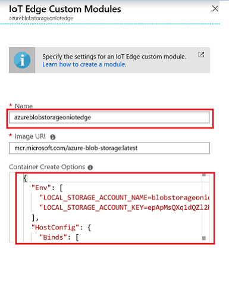
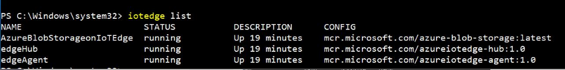
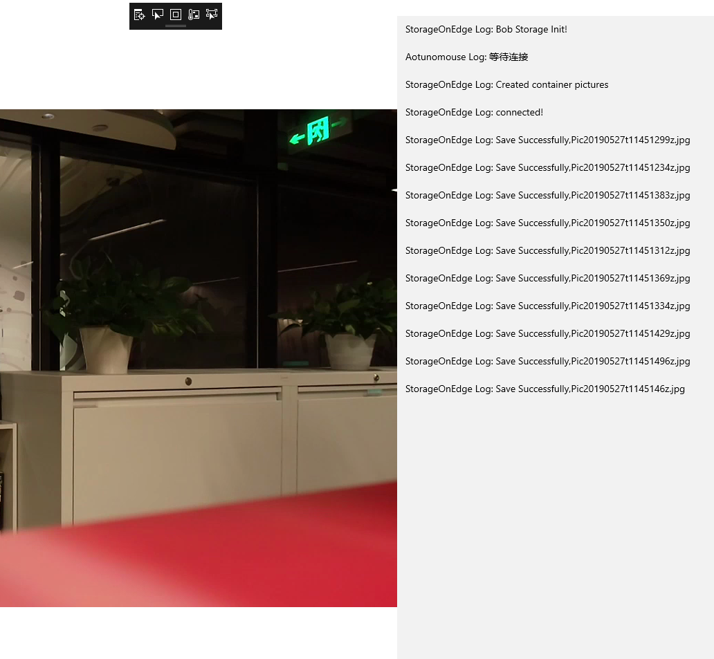

# How to Use an Azure Blob Storage on IoT Edge  

## Quickstarts

#### Introduction Blob Storage

Azure IoT Edge moves cloud analytics and custom business logic to devices that reduce bandwidth costs.Azure Blob Storage on IoT Edge enables Edge-local applications that use Azure Storage SDK to alternatively store the data locally on an Edge-local blob store. This module allows you to configure it to automatically upload the data from edge to Azure, and provides support for intermittent internet connectivity.[See Azure Blob Storage on IoT Edge](https://azuremarketplace.microsoft.com/en-us/marketplace/apps/marketplace_iot.edge-azure-blob-storage?tab=Overview)

This session is Azure Blob Storage store your Drone capured image on IoT Edge.
 
## How to Do

* Step1: [Deployment Azure Blob Storage  on IoT Edge.](../HowToUseAzureBlobStorage.md#deployment-azure-blob-storage-module-on-iot-edge)
	
* Step2: [Use Azure Blob Storage on IoT Edge to Store your data.](../HowToUseAzureBlobStorage.md#use-azure-blob-storage-module-store-your-data)

## Deployment Azure Blob Storage on IoT Edge.

#### Deploy blob storage to your device

Use the Azure portal to deploy Azure blob Storage on IoT Edge.[The other ways can see here](https://docs.microsoft.com/en-us/azure/iot-edge/how-to-store-data-blob#visual-studio-code-templates). 

The Azure Marketplace provides IoT Edge modules that can be deployed directly to your IoT Edge devices, including Azure Blob Storage on IoT Edge. Follow these steps to deploy the module from the Azure portal.

**1.** In the [Azure portal](https://ms.portal.azure.com/#home), search for "Azure Blob Storage on IoT Edge". And **select** the search result from the Marketplace.
	
	
	
**2.** Choose an IoT Edge device to receive this module. On the Target Devices for IoT Edge Module page, provide the following information:

* Select the **Subscription** that contains the IoT hub you're using.
* Select your **IoT Hub**.
* Select **Find Device** to choose from a list of IoT Edge devices in your IoT hub. 
* Select **Create**.
	 		
**3.** In the **Add Modules** step of the set modules wizard, notice that the **AzureBlobStorageonIoTEdge** module is already listed under **Deployment Modules**. 

**4.** On the **IoT Edge** custom modules page, update the Azure Blob Storage on IoT Edge module with the following steps:

* Change the module **Name** to be lowercase. 
* The default **Container Create Options** the port bindings that your container needs, add your storage account information and a bind for the storage directory on your device. Overwrite the JSON in the portal with the JSON below:
		
```json  				
{
	"Env":[
		"LOCAL_STORAGE_ACCOUNT_NAME=<your storage account name>",
		"LOCAL_STORAGE_ACCOUNT_KEY=<your storage account key>"
	],
	"HostConfig":{
		"Binds":[
			"<storage directory bind>"
			],
		"PortBindings":{
			"11002/tcp":[{"HostPort":"11002"}]
		}
	}
}
```
* Update the JSON that you copied with the following information: 
* Replace **_your storage account name_** with a name .
* Replace **_your storage account key_** with a 64-byte base64 key. Qenerate a key with tools like [GeneratePlus](https://generate.plus/en/base64?gp_base64_base[length]=64). 
You'll use these credentials to access the blob storage from other modules.
* Replace **_storage directory bind_** depending on your container operating system. 

	Windows containers: **_your storage path_** **:C:/BlobRoot**. For example,C:/BlobRoot. 
	

		
The image for after updating Json:
		

			
* Select **Save**.

**5.** Select **Next**;and in the **Specify Routes** step of the wizard, select **Next**;In the **Review Deployment** step of the wizard, select **Submit**.
	
**6.** Return to the **IoT Edge** page,select the IoT Edge device that open its details. 

**7.** Check to see your moduls that are setting up and runnuing with the follow command.

```
iotedge list
```



#### Connect to your blob storage module

Use the account name and account key that you configured for your module to access the blob storage on your IoT Edge device. 
Deployed on the edge device where "Azure Blob Storage on IoT Edge" is running.
Create a connection string for blob storage endpoint.

* The  **ConnectionString** is:
 
``` 
DefaultEndpointsProtocol=https;BlobEndpoint=<myBlobEndpoint>;AccountName=<myAccountName>;AccountKey=<myAccountKey>
```

```
DefaultEndpointsProtocol=[http|https];
BlobEndpoint=myBlobEndpoint;
AccountName=myAccountName;
AccountKey=myAccountKey
```

* the blob endpoint is: 

 **http://_*your device IP*_:11002/_*your account name*_**. 
 
 [More details of blob endpoint](https://docs.microsoft.com/en-us/azure/iot-edge/how-to-store-data-blob#connect-to-your-blob-storage-module)

 
## Use Azure Blob Storage on IoT Edge store your data

#### Download the sample application

use git to download a copy of the application, please click [here](../DJIUWPSampleCode_x64/DJI-IoTEdge) download the sample called 'DJIUWPSampleCode_x64'.

#### Initiate Blob Storage 

##### Try parsing the connection string

Copy your connection string and replace it the value of storageConnectionString

```C#
string StorageAcount = "<your acount >";
string StorageAccessKey = "<your key>";
string IoTEdgeDeviceIP = "127.0.0.1";

string storageConnectionString = "DefaultEndpointsProtocol=https;BlobEndpoint=http://"+ IoTEdgeDeviceIP + ":11002/"+ StorageAcount + ";AccountName="+ StorageAcount + ";AccountKey="+ StorageAccessKey;

// Check whether the connection string can be parsed.
CloudStorageAccount storageAccount;
if (CloudStorageAccount.TryParse(storageConnectionString, out storageAccount))
{
    // If the connection string is valid, proceed with operations against Blob storage here.
    ...
}
else
{
    // Otherwise, let the user know that they need to define the environment variable.
    Console.WriteLine(
        "A connection string has not been defined in the system environment variables. " +
        "Add a environment variable named 'storageconnectionstring' with your storage " +
        "connection string as a value.");
    Console.WriteLine("Press any key to exit the sample application.");
    Console.ReadLine();
}
```

More details in [FPVPage.xaml.cs](https://github.com/LiangJy123/DJI-IotEdge/blob/master/DJIUWPSampleCode/DJIWindowsSDKSample/FPV/FPVPage.xaml.cs).

#### Create the container and set permissions

```C#
// Create the CloudBlobClient that represents the Blob storage endpoint for the storage account.
CloudBlobClient cloudBlobClient = storageAccount.CreateCloudBlobClient();

// Create a container called 'pictures' and append a GUID value to it to make the name unique. 
CloudBlobContainer cloudBlobContainer = cloudBlobClient.GetContainerReference("pictures" + Guid.NewGuid().ToString());
await cloudBlobContainer.CreateAsync();

// Set the permissions so the blobs are public. 
BlobContainerPermissions permissions = new BlobContainerPermissions
{
    PublicAccess = BlobContainerPublicAccessType.Blob
};
await cloudBlobContainer.SetPermissionsAsync(permissions);
```

More details in [FPVPage.xaml.cs](../DJIUWPSampleCode_x64/DJI-IoTEdge/DJI-IoTEdge\BlobStorageOnEdge/BlobStorageOnEdge.cs).

#### Store the picture to Blob storage module

##### Convert stream into byte to save the picture

```C#
using (var stream = new InMemoryRandomAccessStream())
{
    var encoder = await BitmapEncoder.CreateAsync(BitmapEncoder.JpegEncoderId, stream);
    encoder.SetPixelData(BitmapPixelFormat.Rgba8, BitmapAlphaMode.Premultiplied, (uint)width, (uint)height, 96, 96, data);
    await encoder.FlushAsync().AsTask();
    try
        {
         string blobname = "pic" + GetStandTimeStr() + ".jpg";
         CloudBlockBlob cloudBlockBlob = cloudBlobContainer.GetBlockBlobReference(blobname);
         using (var reader = new DataReader(stream))
            {
                 await reader.LoadAsync((uint)stream.Size);
                 var buffer = new byte[(int)stream.Size];
                 reader.ReadBytes(buffer);
                 await cloudBlockBlob.UploadFromByteArrayAsync(buffer, 0, buffer.Length);
                 Writelog(WritelogDest.storagelog, "Save Successfully,"+blobname, Writelogcolor.green);     
			}
		}
		catch (Exception ex)
        {
         Debug.WriteLine(ex.Message);
         Writelog(WritelogDest.storagelog, "Disconnect!" , Writelogcolor.red);
        }
}
```

More details in [FPVPage.xaml.cs](../DJIUWPSampleCode_x64/DJI-IoTEdge/DJI-IoTEdge/BlobStorageOnEdge/BlobStorageOnEdge.cs).

## Evaluate the results on UWP

The repo provide the [sample UWP code](../DJIUWPSampleCode_x64/DJI-IoTEdge/DJI-IoTEdge) to connect DJI drone with the Azure Blob Storage on IoT Edge Device.

Now you can connect DJI drone to the IoT Edge Device than Run the sample code.

#### Build and Run the UWP

1. Open the **DJIWindowsSDKSample.sln** with Visual Studio 2017.
2. Make sure the develop mode is **debug** and platform is **x64**.
3. **Run** the sample



## Reference

*  [Deploy your first IoT Edge module ](https://docs.microsoft.com/en-us/azure/iot-edge/quickstart)
*  [Store data at the edge](https://docs.microsoft.com/en-us/azure/iot-edge/how-to-store-data-blob#configure-auto-tiering-and-auto-expiration-via-azure-portal) 
*  [ Use .NET to create a blob in object storage ](https://docs.microsoft.com/en-us/azure/storage/blobs/storage-quickstart-blobs-dotnet?tabs=windows)

